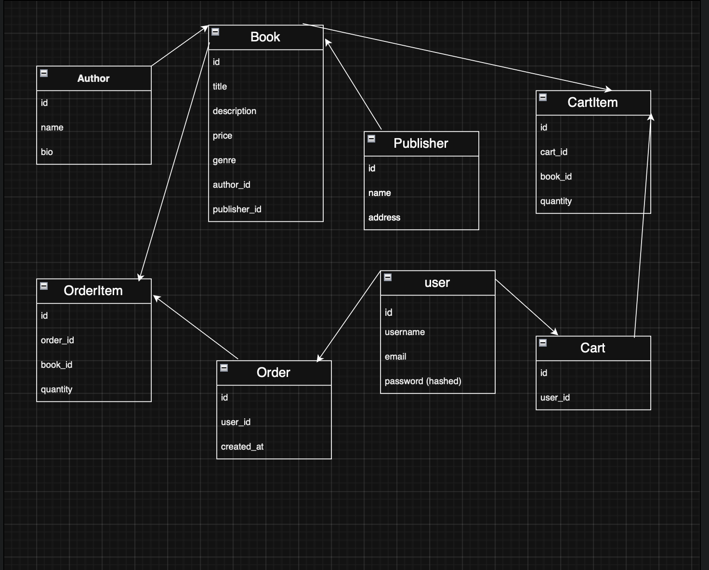

# 📚 Bookstore API
## Description
Bookstore web application where users can browse books, search and filter them by title, author, genre, or publisher. 
Users can register, log in, manage their profile, add books to the cart, and place orders. 
Admins can manage books, authors, and publishers.

## Endpoints
### Books
- `GET /books` - List all books (with search & filters by title, author, genre, publisher, sort)
- `GET /books/{id}` - Get details of one book
- `POST /books` - Add a new book (admin only)
- `PUT /books/{id}` - Update book info (admin only)
- `DELETE /books/{id}` - Delete book (admin only)

### Authors
- `GET /authors` - List all authors
- `GET /authors/{id}` - Get all books by this author
- `POST /authors` - Add a new author (admin only)

### Publishers
- `GET /publishers` - List all publishers
- `GET /publishers/{id}` - Get all books from this publisher
- `POST /publishers` - Add a new publisher (admin only)

### Cart
- `GET /cart` - Get current user’s cart
- `POST /cart` - Add book to cart
- `DELETE /cart/{book_id}` - Remove book from cart

### Orders
- `GET /orders` - List all orders of the current user
- `POST /orders` - Create a new order (from cart)

### Auth
- `POST /auth/register` - Register a new user
- `POST /auth/login` - Log in

### Profile
- `GET /profile` - Get user profile
- `PUT /profile` - Update user profile

### Info
- `GET /about` - About page
- `GET /contacts` - Contact and delivery info

### Books

| Request            | Request Body | Response Body |
|--------------------|--------------|---------------|
| **GET** /books     |              | `[{"id": 1, "title": "The Hobbit", "author": "J.R.R. Tolkien", "price": 300}, ...]` |
| **GET** /books/1   |              | `{"id": 1, "title": "The Hobbit", "author": "J.R.R. Tolkien", "price": 300}` |
| **POST** /books    | `{ "title": "1984", "author": "George Orwell", "price": 250 }` | `{"id": 2, "title": "1984", "author": "George Orwell", "price": 250}` |
| **DELETE** /books/1 |              | `{ "message": "Book deleted" }` |

---

### Authors

| Request              | Request Body | Response Body |
|----------------------|--------------|---------------|
| **GET** /authors     |              | `[{"id": 1, "name": "J.R.R. Tolkien"}, ...]` |
| **GET** /authors/1   |              | `{"id": 1, "name": "J.R.R. Tolkien", "books": ["The Hobbit", "LOTR"]}` |
| **POST** /authors    | `{ "name": "George Orwell" }` | `{"id": 2, "name": "George Orwell"}` |

---

### Publishers

| Request                 | Request Body | Response Body |
|-------------------------|--------------|---------------|
| **GET** /publishers     |              | `[{"id": 1, "name": "Penguin Books"}, ...]` |
| **GET** /publishers/1   |              | `{"id": 1, "name": "Penguin Books", "books": ["1984", "Animal Farm"]}` |

---

### Orders

| Request             | Request Body | Response Body |
|---------------------|--------------|---------------|
| **GET** /orders     |              | `[{"id": 1, "user_id": 1, "books": [1, 2], "total": 550}]` |
| **POST** /orders    | `{ "user_id": 1, "books": [1, 2] }` | `{"id": 2, "user_id": 1, "books": [1, 2], "total": 550}` |

---

### Auth

| Request                  | Request Body | Response Body |
|--------------------------|--------------|---------------|
| **POST** /auth/register  | `{ "username": "mila", "password": "12345" }` | `{ "message": "User registered" }` |
| **POST** /auth/login     | `{ "username": "mila", "password": "12345" }` | `{ "token": "abc123" }` |

## Database Schema

